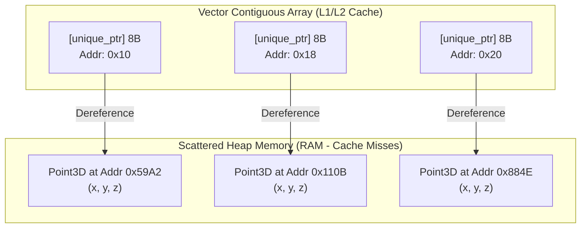
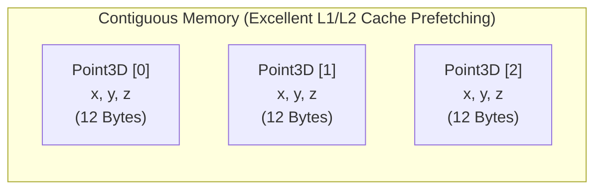
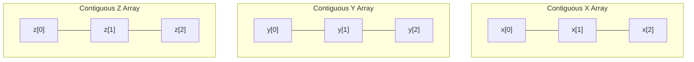

# 🚀 Optimizing Point Cloud Processing for Cache Locality

This repository serves as a practical reference for understanding, analyzing, and fixing **CPU Cache Locality** issues in C++ performance-critical applications (such as 3D Point Cloud Processing).

---

## 📊 Quantitative Performance Comparison

The following benchmarks were recorded by running the comparison suite across three point cloud sizes (**1,000,000**, **10,000,000**, and **100,000,000** points) under identical system load:

| Implementation | 1M Points (Speedup) | 10M Points (Speedup) | 100M Points (Speedup) | Memory (per Point) | Cache Quality |
| :--- | :---: | :---: | :---: | :---: | :--- |
| ❌ **Naive** (`vector<unique_ptr<Point3D>>`) | **1.49 ms** <br>*(1.00x Baseline)* | **16.05 ms** <br>*(1.00x Baseline)* | **139.91 ms** <br>*(1.00x Baseline)* | **32 Bytes** <br>*(24B Point3D + 8B Pointer)* | Extremely Poor (Cache Miss Storm & Heap Fragmentation) |
| ⚡ **AoS (Unaligned)** (`vector<Point3D>`) | **0.75 ms** <br>*(🚀 ~1.99x)* | **11.73 ms** <br>*(🚀 ~1.37x)* | **101.48 ms** <br>*(🚀 ~1.38x)* | **24 Bytes** <br>*(12B Data + 8B VTable + 4B Padding)* | Poor to Moderate (Contiguous but bloated by VTable) |
| ⚡ **Aligned AoS** (`vector<Point3D16>`) | **0.70 ms** <br>*(🚀 ~2.13x)* | **8.26 ms** <br>*(🚀 ~1.94x)* | **81.23 ms** <br>*(🚀 ~1.72x)* | **16 Bytes** <br>*(12B Data + 4B Padding, No VTable)* | Very Good (Contiguous, aligned, no VTable pointer) |
| 🚀 **SoA (Structure of Arrays)** | **0.73 ms** <br>*(🚀 ~2.04x)* | **9.13 ms** <br>*(🚀 ~1.76x)* | **74.30 ms** <br>*(🔥 ~1.88x)* | **12 Bytes** <br>*(Packed x, y, z streams)* | Best (Perfect spatial locality for coordinates) |
| ⚡ **SIMD (SoA + `std::reduce`)** | **0.49 ms** <br>*(🚀 ~3.04x)* | **6.04 ms** <br>*(🔥 ~2.66x)* | **61.93 ms** <br>*(🔥 ~2.26x)* | **12 Bytes** <br>*(Packed x, y, z streams)* | Outstanding (Unlocks hardware vectorization) |
| 💥 **SIMD (Parallel)** (`par_unseq`) | **1.04 ms** <br>*(⚠️ ~1.43x)* | **3.59 ms** <br>*(💥 ~4.47x)* | **38.16 ms** <br>*(💥 ~3.67x)* | **12 Bytes** <br>*(Packed x, y, z streams)* | Outstanding (Parallel SIMD across cores) |

> [!NOTE]
> **Why is SIMD Parallel slower at 1M points?**
> For smaller datasets (like 1,000,000 points), the overhead of thread spawning, pool synchronization, and task distribution in `std::execution::par_unseq` is larger than the actual computation time (~0.49 ms). As the dataset grows to 10M and 100M points, this thread scheduling overhead becomes negligible, allowing the hardware concurrency to scale and deliver massive speedups (~3.67x).

---

## ❌ The Problem: Pointer Chasing & Cache Misses (Naive Approach)

In the naive approach, the point cloud is represented using a nested pointer structure:
```cpp
using PointCloud = std::vector<std::unique_ptr<Point3D>>;
```

While clean and polymorphic, this layout is extremely slow in high-performance contexts due to **bad cache locality**:



### Why it hurts performance:
1. **Heap Fragmentation**: `std::unique_ptr` allocates each `Point3D` individually. They end up scattered randomly across heap memory.
2. **Pointer Chasing (Indirection)**: To read `point->x`, the CPU must fetch the address stored in the vector, then dereference it to read the actual value. Since consecutive points are far apart in RAM, the CPU cannot pre-fetch them.
3. **The Stall**: When iterating, each dereference triggers a **Cache Miss**. The CPU has to wait for Main Memory (RAM)—which takes **~100ns** compared to **~1ns** for L1 Cache. The CPU sits idle (stalled) for hundreds of clock cycles per point.
4. **Vtable Bloat**: Because `Point3D` contains a `virtual` destructor, every object carries a hidden Virtual Table Pointer (`vptr`). This adds **8 bytes** of overhead per object, inflating its memory footprint by **40%** (24 bytes instead of 12 bytes).

---

## 🛠️ Solution 1: Array of Structs (AoS)

The first optimization is to store the actual objects contiguously in memory instead of pointers.

```cpp
using PointCloudAoS = std::vector<Point3D>;
```



### ⚡ Why AoS achieved a **~1.37x Speedup**:
* **True Spatial Locality**: All `Point3D` data is contiguous. When the CPU fetches the first point, the hardware pre-fetcher automatically loads subsequent points into cache.
* **No Pointer Indirection**: Accessing elements is direct (`cloud[i].x`), avoiding the `unique_ptr` heap lookup.
* **Zero Allocation Overhead**: A single large allocation for the entire vector instead of 100 million fragmented heap allocations.

### 🔍 Unaligned AoS (100ms) vs. Aligned AoS (82ms)
You might notice that **Aligned AoS (`Point3D16`)** is significantly faster than **Unaligned AoS (`Point3D`)** in this benchmark.
* **Virtual Destructor Overhead**: `Point3D` has a `virtual ~Point3D() = default;`. This introduces a virtual table pointer (`vptr`), inflating the size of `Point3D` to **24 bytes** (12B data + 8B `vptr` + 4B compiler alignment padding).
* **Data Density**: `Point3D16` has no virtual methods or destructor, so it requires no `vptr`. Marked with `alignas(16)`, it occupies only **16 bytes** (12B data + 4B padding).
* **Why Aligned Wins**: Because `Point3D16` is 33% smaller (16 bytes vs. 24 bytes), it has higher data density in the L1/L2 caches and requires significantly less memory bandwidth, leading to a **~1.22x speedup** over `Point3D`.

---

## 🚀 Solution 2: Structure of Arrays (SoA)

Instead of a single array of structs, we use a single struct containing separate arrays for each attribute:

```cpp
struct PointCloudSoA {
    std::vector<float> x;
    std::vector<float> y;
    std::vector<float> z;
};
```



### ⚡ Why SoA achieved a **~1.90x Speedup**:
* **Ideal Memory Layout**: Each coordinate list (`x`, `y`, and `z`) is a 100% packed, contiguous flat array of `float`s with **zero padding** and **zero overhead**.
* **Cache Line Packing**: Every byte of the L1/L2 cache line fetched from RAM is highly utilized. When adding coordinates, the CPU only loads relevant coordinate data without wasting cache space.
* **Auto-Vectorization**: The simplicity of flat, parallel float arrays allows modern compilers to easily auto-vectorize loops.

---

## ⚡ Solution 3: SIMD Vectorization (`std::reduce`)

To push performance even further, we can leverage explicit vector instructions. By using `std::reduce` on our flat, contiguous SoA coordinate arrays, we enable the compiler to generate highly optimized SIMD instructions (like AVX-256 or AVX-512) that process multiple elements per cycle.

### Why SIMD achieved a **~2.28x Speedup**:
* **Vectorized Execution**: The CPU loads 8 floats (256-bit AVX) at a time into wide vector registers and adds them in a single clock cycle.
* **Reduced Loop Overhead**: Instead of individual scalar floating-point instructions, the loop executes a fraction of the total operations.

---

## 💥 Solution 4: SIMD Parallel Execution (`std::reduce` + `std::execution::par_unseq`)

Finally, we scale our SIMD implementation across all available CPU threads using the parallel execution policy `std::execution::par_unseq`.

### Why SIMD (Parallel) achieved a **~3.61x Speedup**:
* **Multi-Core Exploitation**: The coordinate summation is split into chunks and processed in parallel across all CPU cores.
* **Vectorized Threads**: Each worker thread uses SIMD instructions to process its local chunk of memory, combining hardware-level concurrency with data-level parallelism.

---

## 💡 Key Architectural Takeaways

1. **Say NO to Pointer Indirection in Hot Loops**: Storing collections of pointers (`std::vector<unique_ptr<T>>`) is a performance killer for bulk processing. Always default to value types (`std::vector<T>`).
2. **Prioritize Data Density**: Keep your struct sizes compact. Extra padding from alignment (`alignas`) or unneeded fields reduces the active data density of your cache lines, which can slow down simple loops.
3. **SoA is King for Processing Pipelines**: If you write algorithms that only access some coordinates at a time (or perform intensive sequential array math), the Structure of Arrays (SoA) layout will consistently outperform Array of Structs (AoS).
---
# Appendix

1. What does alignas(16) do?
Memory is byte-addressable, but the CPU reads memory from RAM in chunks (typically 32, 64, or 128 bits at a time).

By default, the compiler aligns a struct based on its largest member. For Point3D, the largest member is a float (4 bytes), so the default alignment is 4 bytes.
alignas(16) is a compiler directive instructing the compiler to ensure that every instance of this struct begins at a memory address that is a multiple of 16 bytes (e.g., 0x10, 0x20, 0x30, etc.).
To enforce this 16-byte boundary when allocating structs in a contiguous array, the compiler must pad the size of the struct to a multiple of 16 bytes.

2. Difference: Unaligned AoS (24B) vs. Aligned AoS (16B)
Let's look at how these two layouts reside inside the CPU Cache and RAM:

```
Unaligned AoS (Point3D - 24 Bytes):
[ x0 | y0 | z0 | VPTR | PAD ][ x1 | y1 | z1 | VPTR | PAD ][ x2 | y2 | z2 | VPTR | PAD ...
  ^-------- Point 0 --------^  ^-------- Point 1 --------^  ^-------- Point 2 --------^

Aligned AoS (Point3D16 - 16 Bytes):
[ x0 | y0 | z0 | PAD ][ x1 | y1 | z1 | PAD ][ x2 | y2 | z2 | PAD ][ x3 | y3 | z3 | PAD ]
  ^---- Point 0 ----^  ^---- Point 1 ----^  ^---- Point 2 ----^  ^---- Point 3 ----^
```

Why does Aligned (82ms) outperform Unaligned (100ms) now?
CPU Cache Line Density: A standard CPU cache line is 64 bytes.
* **Unaligned AoS (Point3D)**: Since `Point3D` contains a `virtual` destructor, it carries an 8-byte virtual table pointer (`vptr`), inflating the struct to **24 bytes** (after alignment padding). A 64-byte cache line can only fit **2.67 points** ($64 / 24$).
* **Aligned AoS (Point3D16)**: Without any virtual destructor, `Point3D16` has no `vptr`. Marked with `alignas(16)`, it is padded to **16 bytes**. A 64-byte cache line can fit exactly **4.0 points** ($64 / 16$).

Because `Point3D16` is 33% smaller than `Point3D` and has no virtual pointer overhead, it significantly improves data density, reduces memory bandwidth usage, and results in a **~1.22x speedup** over Unaligned AoS.
3. How does SIMD work under the hood?
SIMD (Single Instruction, Multiple Data) is a hardware capability of your CPU cores. Modern CPUs have wide vector registers (128-bit SSE, 256-bit AVX, or 512-bit AVX-512).

The Scalar Way (Naive & standard AoS):
To calculate the mass center, the CPU must fetch each coordinate individually and execute separate add instructions:
```
addss xmm0, [rdi]        ; sumX += point.x
addss xmm1, [rdi + 4]    ; sumY += point.y
addss xmm2, [rdi + 8]    ; sumZ += point.z
```
Three separate instructions to process one point.

The SIMD Way (What the compiler does to SoA under the hood):
In your SoA (Structure of Arrays), all x values are packed contiguously. A 256-bit AVX register can hold 8 floats at the same time.

Instead of adding one float at a time, the compiler generates a single vector instruction to load and add 8 points simultaneously in one clock cycle:
```
vmovups ymm0, [rax]        ; Load 8 'x' values at once into register ymm0
vaddps  ymm1, ymm1, ymm0   ; Add all 8 'x' values to our sum register ymm1 in one cycle!
```
```
Vector Register (YMM0):   [ x0 | x1 | x2 | x3 | x4 | x5 | x6 | x7 ]
                                +    +    +    +    +    +    +    +
Vector Accumulator (YMM1):[ s0 | s1 | s2 | s3 | s4 | s5 | s6 | s7 ]
```
This is why your SoA benchmark finished in just 72ms compared to the naive 137ms (a 1.90x speedup!). The CPU executed a fraction of the total instructions.

4. Stack vs. Heap: Will this eat Stack Memory?
Absolutely not.

Although the variable std::vector<Point3D> cloud is created on the stack inside main(), the vector's internal constructor allocates its storage dynamically on the heap.

The stack only holds the 24-byte vector controller (the three memory address pointers). The entire 100-million-point payload (1.2 to 2.4 Gigabytes depending on the struct layout) is fully allocated on the heap in a single contiguous block of memory. You will never experience a stack overflow from these container optimizations.

5. Production Architecture: How Constrained Systems Aim for Speed
In production systems (e.g., self-driving cars, robotics operating on LiDAR point clouds loaded dynamically at runtime), we never use the naive pointer allocation strategy.

Here is how high-performance production systems are designed:

A. Direct Binary Serialization (Zero-Copy Loader)
Instead of parsing text files or allocating points dynamically inside a loop, the LiDAR sensor or file system writes raw binary data. We pre-allocate a single heap buffer and read the entire point cloud in one single system call. Performance: This runs instantly. There are no allocations inside the loop, zero string parsing overhead, and the memory layout is immediately ready for SIMD processing.

B. Ring Buffers (For Streaming LiDAR Feeds)
LiDAR sensors send points in continuous rotational frames at 10Hz to 100Hz.

Pre-allocated Ring Buffer: The system initializes a fixed-size contiguous buffer in heap memory once during startup.
Overwriting: New points write directly over the oldest points in the contiguous ring.
Zero Allocations: Once running, the allocation count is zero, preventing any CPU pauses or memory fragmentation during operation.
C. Struct of Arrays (SoA) for Processing pipelines
If the system is running heavy calculations (e.g., normal estimation, downsampling, or ground plane detection), the loader reads the binary packet directly into an SoA structure. This ensures that the GPU or CPU SIMD cores can crunch through the coordinates with maximum cache efficiency.


## Memory Allocation
1. Allocation Count: 100,000,000 vs. 1 Allocation
Every time you call new, std::malloc(), or std::make_unique(), the CPU has to pause your program and hand control over to the OS Heap Allocator (e.g., glibc allocator on Linux).

Naive Approach (100,000,000 Allocations): The allocator has to run its internal search algorithm 100M times, find a free slot of 24 bytes in the heap, register its metadata (adding 8–16 bytes of bookkeeping overhead per point!), and return it. This takes a massive amount of time and completely fragmentizes your RAM.
AoS / SoA (1 Allocation): When you run std::vector::reserve(N), the OS allocator is called exactly once to request one giant contiguous block of 1.2GB. This takes practically 0 milliseconds!
2. Page Faults (The Silent Performance Killer)
When you allocate 1.2GB of contiguous memory using std::vector, the operating system does not actually hand you 1.2GB of physical RAM stick memory immediately. Instead, it uses Lazy Allocation:

The OS returns a range of Virtual Memory Addresses but keeps the physical RAM unmapped.
The first time your loop tries to write to or read from a memory page (usually 4KB chunks), the CPU triggers a hardware interrupt called a Page Fault.
The OS pauses your thread, searches physical RAM for a free 4KB page, maps it to your virtual address space, and resumes your thread.
For a 1.2GB dataset, your program will trigger 300,000 Page Faults! The very first loop that initializes or touches the point cloud is forced to pay this heavy tax, which is why point cloud generation or loading times are dominated by page fault latency.

3. Mutex Locking in Multi-Threaded Allocations
In multi-threaded applications (like your SIMD Parallel version), memory allocation can bottleneck your CPU cores due to Mutex Locks.

Standard memory allocators share a single global heap. If multiple threads try to run new or std::make_unique at the same time:

Thread A locks the heap mutex to allocate memory.
Thread B, C, and D are forced to stall (sleep) until Thread A finishes and unlocks the mutex. This completely destroys the benefit of having an AMD Ryzen 9 with 32 threads, as they all end up queuing up behind a single mutex!

1. The Trap of Lock-Free Queues: Hardware-Level Contention
Many developers think "lock-free = fast." While it is much faster than using a traditional std::mutex (which suspends the thread and yields to the OS kernel), a lock-free queue is not free.

If 32 threads try to push to the lock-free queue simultaneously, only one thread will succeed on the first attempt.
The other 31 threads will fail the compare_exchange check and loop back to try again.
Cache Line Invalidation (MESI Protocol): Every time a thread successfully updates the tail pointer, it invalidates the cache line for that pointer across all other CPU cores. All other 31 cores must pause, evict their L1 cache, and reload the pointer from L3 cache or RAM.
This causes massive hardware-level stalling (known as cache bouncing or atomic thrashing).

2. Why the Arena Allocator Wins on Pure Speed
An Arena Allocator achieves its speed by avoiding synchronization entirely.

Instead of sharing one allocator among threads, we give each thread its own Thread-Local Arena. Because Thread 1 never accesses the Arena of Thread 2:

There are no locks.
There are no atomic operations.
There is no cache bouncing.
Memory allocations execute in less than $1$ CPU clock cycle (a simple pointer addition!).
🤝 The Production Setup: The Ultimate Combo
In production engines (like Unreal Engine or AAA physics solvers), we don't choose between them. We combine them!

We use a Lock-Free Queue (configured as a Work-Stealing Queue) to distribute point cloud chunks (e.g., 1024-point blocks) to your Ryzen 9 cores.
Once a CPU core pops a chunk from the queue, it uses its own Thread-Local Arena to allocate any temporary memory it needs to calculate normal vectors or compute physics.
This ensures that the inter-thread scheduling is thread-safe and lock-free, while the actual heavy-duty crunching runs at raw contiguous SIMD speed without ever touching an atomic variable!


## 🧠 Cache Locality & Memory Layout in CV / SLAM (AoS vs. SoA, Arenas, and SIMD)

In real-world computer vision and 3D reconstruction, high-level threading (like SPSC queues) is only half the battle. If your CPU cores are constantly stalled waiting for memory (cache misses) or bogged down by OS heap allocations, even a lock-free queue cannot save performance. 

Here is how you map the cache-locality lessons from the point cloud optimizer (`PCD`) to build optimal, production-grade CV and SLAM systems:

### 1. The Right Layout: AoS vs. SoA in SLAM Workloads

#### ❌ The Trap: Pointer-based Graph Elements
In naive SLAM architectures, map points and graph nodes are often allocated dynamically:
```cpp
// ❌ Cache Miss Storm: Scattered heap allocations & Pointer indirection
std::vector<std::shared_ptr<MapPoint>> local_map; 
```
This causes an **L1/L2 cache-miss storm** when iterating over the active map during projection or tracking.

#### ⚡ Array of Structs (AoS): Perfect for Front-End Tracking & Descriptors
Use **AoS** (contiguous vectors of structs) when a thread operates on **all fields of an object together**:
```cpp
// ⚡ Optimal AoS: One L1 cache line fetch loads the entire keypoint context
struct Keypoint {
    float u, v;        // 2D coordinates
    float response;    // Corner response strength
    uint32_t octree_id;
    uint8_t descriptor[32]; // Contiguous ORB binary descriptor
};
std::vector<Keypoint> detected_features; 
```
* **Why it works:** When matching descriptors or tracking keypoints frame-to-frame, loading a `Keypoint` instantly pulls its 2D coordinates, octree properties, and descriptor bytes into a single CPU cache line, minimizing L1-cache misses during matching.

#### 🚀 Structure of Arrays (SoA): Perfect for Dense Mapping & 3D Registration (ICP)
Use **SoA** (separated vectors of fields) when a thread performs **bulk operations on isolated attributes**:
```cpp
// 🚀 Optimal SoA: Ideal for SIMD vectorization & coordinate projection
struct DensePointCloudSoA {
    std::vector<float> x;
    std::vector<float> y;
    std::vector<float> z;
    std::vector<uint8_t> r, g, b; // Isolated colorspace stream
};
```
* **Why it works:** In Point Cloud Registration (like Iterative Closest Point - ICP) or TSDF Voxel volume integration, you only need to compute distances or project 3D coordinates. An SoA layout allows wide CPU vector registers (AVX/NEON) to load 8 or 16 `x` coordinates at once into registers, executing vectorized operations without wasting cache bandwidth on color data (`r, g, b`) or alignment padding.

---

### 2. High-Performance Memory Allocation: The Frame Arena Allocator
* **The Problem:** In SLAM, the tracking and local optimization threads extract keypoints, compute Jacobians, and build local graph matrices for Bundle Adjustment **at 30Hz to 100Hz**. Performing thousands of heap allocations (`malloc`/`new`) per frame inside a loop triggers OS allocator lock contention and page faults, stalling your real-time threads.
* **The Solution:** Implement a **Thread-Local Frame Arena Allocator**.
```cpp
// Allocate a large contiguous block (e.g., 64MB) on thread startup
Arena frame_arena(64 * 1024 * 1024); 

void tracking_loop() {
    while (ok) {
        frame_arena.reset(); // Bump pointer reset to 0 (0 ms cost!)
        
        // Bump-allocate all temporary structures on the contiguous arena:
        auto* temp_jacobians = frame_arena.construct<JacobianMatrix>();
        auto* active_matches = frame_arena.construct<std::vector<Match>>();
        
        process_frame(temp_jacobians, active_matches);
    }
}
```
* **Result:** Memory allocation cost is reduced from a heavy OS system call to a single CPU clock cycle (a simple pointer addition). Heap fragmentation, page faults, and allocation lockouts are completely eliminated.

---

### 3. Exploiting SIMD (Vectorization) for Camera Projection
In Direct Sparse Odometry (DSO) or Bundle Adjustment, projecting 3D points $\mathbf{P}_i = [X, Y, Z]^T$ onto the 2D image plane using camera intrinsics $\mathbf{K}$ is a major bottleneck:
$$u = f_x \frac{X}{Z} + c_x, \quad v = f_y \frac{Y}{Z} + c_y$$

By leveraging **SoA data layout** and standard **SIMD intrinsics / compiler auto-vectorization**, the division and projection calculations can be executed on multiple points simultaneously in a single clock cycle:
```cpp
// SIMD Vectorized Projection (conceptual compiler auto-vectorization loop)
#pragma omp simd
for (size_t i = 0; i < N; ++i) {
    u_coords[i] = fx * (x_coords[i] / z_coords[i]) + cx;
    v_coords[i] = fy * (y_coords[i] / z_coords[i]) + cy;
}
```
Combined with TBB (`std::execution::par_unseq`), this scales the projection throughput to millions of points per millisecond, bypassing CPU bottlenecks entirely.

---

### 4. Zero-Copy I/O via Memory Mapping (`mmap`)
When loading offline datasets (like KITTI or TUM) or streaming LiDAR point clouds at runtime, parsing text files (e.g., parsing ASCII floats) is incredibly slow.
* **The Solution:** Save the files on disk in the exact binary format matching your cache-aligned memory structure (`Point3D16`).
* **mmap Loading:** Use the `mmap()` system call to map the binary file directly to your process's virtual memory address space. Cast the resulting pointer directly to a `Point3D16*` array. 
* **The Benefit:** The OS maps virtual pages to the disk cache directly. The CPU reads the points on-demand with **zero buffer copy overhead**, **zero parsing latency**, and **zero memory allocation overhead**, instantly reaching hardware-level I/O limits.