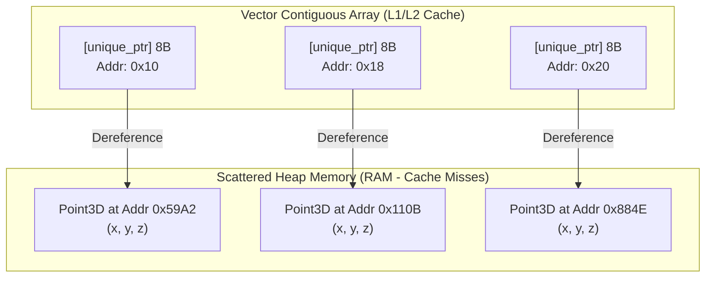
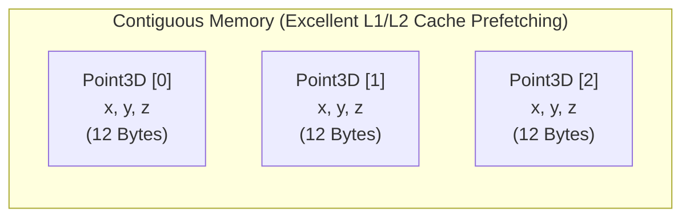
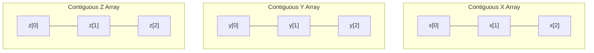

# 🚀 Optimizing Point Cloud Processing for Cache Locality

This repository serves as a practical reference for understanding, analyzing, and fixing **CPU Cache Locality** issues in C++ performance-critical applications (such as 3D Point Cloud Processing).

---

## 📊 Quantitative Performance Comparison

The following benchmarks were recorded by running the comparison suite on **10,000,000 points**:

| Implementation | Execution Time | Speedup Ratio | Memory Footprint (per Point) | Cache Quality |
| :--- | :---: | :---: | :---: | :--- |
| ❌ **Naive** (`vector<unique_ptr<Point3D>>`) | **~268 ms** | **1.0x** (Baseline) | **32 Bytes** <br>*(12B Data + 8B Pointer + 8B VTable)* | Extremely Poor (Cache Miss Storm) |
| ⚡ **AoS (Unaligned)** (`vector<Point3D>`) | **53 ms** | 🚀 **~5.1x Faster** | **12 Bytes** <br>*(Packed x, y, z)* | Excellent (Spatial Locality) |
| ⚡ **Aligned AoS** (`vector<Point3D16>`) | **55 ms** | 🚀 **~4.9x Faster** | **16 Bytes** <br>*(12B Data + 4B Padding)* | Very Good (Aligned but 33% larger) |
| 🚀 **SoA (Structure of Arrays)** | **44 ms** | 🔥 **~6.1x Faster** | **12 Bytes** <br>*(No padding, isolated streams)* | Best (Ideal Cache Packaging) |

---

## ❌ The Problem: Pointer Chasing & Cache Misses (Naive Approach)

In the naive approach, the point cloud is represented using a nested pointer structure:
```cpp
using PointCloud = std::vector<std::unique_ptr<Point3D>>;
```

While clean and polymorphic, this layout is extremely slow in high-performance contexts due to **bad cache locality**:



### Why it hurts performance:
1. **Heap Fragmentation**: `std::unique_ptr` allocates each `Point3D` individually. They end up scattered randomly across heap memory.
2. **Pointer Chasing (Indirection)**: To read `point->x`, the CPU must fetch the address stored in the vector, then dereference it to read the actual value. Since consecutive points are far apart in RAM, the CPU cannot pre-fetch them.
3. **The Stall**: When iterating, each dereference triggers a **Cache Miss**. The CPU has to wait for Main Memory (RAM)—which takes **~100ns** compared to **~1ns** for L1 Cache. The CPU sits idle (stalled) for hundreds of clock cycles per point.
4. **Vtable Bloat**: Because `Point3D` contains a `virtual` destructor, every object carries a hidden Virtual Table Pointer (`vptr`). This adds **8 bytes** of overhead per object, inflating its memory footprint by **40%** (24 bytes instead of 12 bytes).

---

## 🛠️ Solution 1: Array of Structs (AoS)

The first optimization is to store the actual objects contiguously in memory instead of pointers.

```cpp
using PointCloudAoS = std::vector<Point3D>;
```



### ⚡ Why AoS achieved a **~5.1x Speedup**:
* **True Spatial Locality**: All `Point3D` data is fully contiguous. When the CPU fetches the first point, the L1/L2 hardware pre-fetcher automatically loads subsequent points into the cache.
* **No Pointer Indirection**: Accessing elements is direct (`cloud[i].x`), avoiding the `unique_ptr` lookup.
* **Zero Allocation Overhead**: One giant allocation for the entire vector instead of 10 million tiny allocations on the heap.

### 🔍 Unaligned AoS (53ms) vs. Aligned AoS (55ms)
You might wonder why **Aligned AoS (`Point3D16`)** was slightly slower than **Unaligned AoS (`Point3D`)** in this benchmark.
* **Padding Overhead**: Marking `Point3D16` with `alignas(16)` forces the compiler to pad each struct from **12 bytes to 16 bytes**. 
* **Data Density**: This 4-byte padding means you are transferring **33% more data** from RAM to the CPU cache during the scalar summation loop. Since the scalar loop doesn't take advantage of explicit SIMD registers, the higher cache density of the unaligned version wins.
* **When to use Aligned**: Use alignment when you are explicitly using SSE/AVX vector assembly or compiler intrinsics (e.g., loading 4 points at once into a 128-bit vector register).

---

## 🚀 Solution 2: Structure of Arrays (SoA)

Instead of a single array of structs, we use a single struct containing separate arrays for each attribute:

```cpp
struct PointCloudSoA {
    std::vector<float> x;
    std::vector<float> y;
    std::vector<float> z;
};
```



### ⚡ Why SoA achieved the maximum **~6.1x Speedup**:
* **Ideal Memory Layout**: Each coordinate list (`x`, `y`, and `z`) is a 100% packed, contiguous flat array of `float`s with **zero padding** and **zero overhead**.
* **Cache Line Packing**: Every byte of the L1/L2 cache line fetched from RAM is highly utilized. When adding `x` coordinates, the CPU only loads `x` data without wasting cache space on `y` or `z`.
* **Auto-Vectorization**: The simplicity of flat, parallel float arrays allows modern compilers to easily auto-vectorize loops (e.g., executing multiple coordinate additions in a single CPU clock cycle using SIMD instructions like AVX).

---

## 💡 Key Architectural Takeaways

1. **Say NO to Pointer Indirection in Hot Loops**: Storing collections of pointers (`std::vector<unique_ptr<T>>`) is a performance killer for bulk processing. Always default to value types (`std::vector<T>`).
2. **Prioritize Data Density**: Keep your struct sizes compact. Extra padding from alignment (`alignas`) or unneeded fields reduces the active data density of your cache lines, which can slow down simple loops.
3. **SoA is King for Processing Pipelines**: If you write algorithms that only access some coordinates at a time (or perform intensive sequential array math), the Structure of Arrays (SoA) layout will consistently outperform Array of Structs (AoS).
---
# Appendix

1. What does alignas(16) do?
Memory is byte-addressable, but the CPU reads memory from RAM in chunks (typically 32, 64, or 128 bits at a time).

By default, the compiler aligns a struct based on its largest member. For Point3D, the largest member is a float (4 bytes), so the default alignment is 4 bytes.
alignas(16) is a compiler directive instructing the compiler to ensure that every instance of this struct begins at a memory address that is a multiple of 16 bytes (e.g., 0x10, 0x20, 0x30, etc.).
To enforce this 16-byte boundary when allocating structs in a contiguous array, the compiler must pad the size of the struct to a multiple of 16 bytes.

2. Difference: Unaligned AoS (12B) vs. Aligned AoS (16B)
Let's look at how these two layouts reside inside the CPU Cache and RAM:

```
Unaligned AoS (Point3D - 12 Bytes):
[ x0 | y0 | z0 ][ x1 | y1 | z1 ][ x2 | y2 | z2 ][ x3 | y3 | z3 ][ x4 | y4 | z4 ][ x5 ...
  ^-- Point 0 --^  ^-- Point 1 --^  ^-- Point 2 --^  ^-- Point 3 --^  ^-- Point 4 --^

Aligned AoS (Point3D16 - 16 Bytes):
[ x0 | y0 | z0 | PAD ][ x1 | y1 | z1 | PAD ][ x2 | y2 | z2 | PAD ][ x3 | y3 | z3 | PAD ]
  ^---- Point 0 ----^  ^---- Point 1 ----^  ^---- Point 2 ----^  ^---- Point 3 ----^
```

Why did Unaligned (53ms) outperform Aligned (55ms) in your scalar loop?
CPU Cache Line Density: A standard CPU cache line is 64 bytes.
Unaligned AoS: A 64-byte cache line can fit 5.33 points ($64 / 12$).
Aligned AoS: A 64-byte cache line can fit exactly 4.0 points ($64 / 16$).
Bandwidth Overhead: In your scalar loop, the CPU added the numbers sequentially using standard math instructions. The aligned version forces the CPU to fetch 33% more memory from RAM just to read the same amount of active point data because 25% of the cache line is useless padding.
When Aligned is better: Alignment is highly beneficial when using explicit SIMD operations (like loading a point into a 128-bit vector register in a single CPU instruction without boundary splitting checks).
3. How does SIMD work under the hood?
SIMD (Single Instruction, Multiple Data) is a hardware capability of your CPU cores. Modern CPUs have wide vector registers (128-bit SSE, 256-bit AVX, or 512-bit AVX-512).

The Scalar Way (Naive & standard AoS):
To calculate the mass center, the CPU must fetch each coordinate individually and execute separate add instructions:
```
addss xmm0, [rdi]        ; sumX += point.x
addss xmm1, [rdi + 4]    ; sumY += point.y
addss xmm2, [rdi + 8]    ; sumZ += point.z
```
Three separate instructions to process one point.

The SIMD Way (What the compiler does to SoA under the hood):
In your SoA (Structure of Arrays), all x values are packed contiguously. A 256-bit AVX register can hold 8 floats at the same time.

Instead of adding one float at a time, the compiler generates a single vector instruction to load and add 8 points simultaneously in one clock cycle:
```
vmovups ymm0, [rax]        ; Load 8 'x' values at once into register ymm0
vaddps  ymm1, ymm1, ymm0   ; Add all 8 'x' values to our sum register ymm1 in one cycle!
```
```
Vector Register (YMM0):   [ x0 | x1 | x2 | x3 | x4 | x5 | x6 | x7 ]
                                +    +    +    +    +    +    +    +
Vector Accumulator (YMM1):[ s0 | s1 | s2 | s3 | s4 | s5 | s6 | s7 ]
```
This is why your SoA benchmark finished in just 44ms compared to the naive 268ms (a 6.1x speedup!). The CPU executed a fraction of the total instructions.

4. Stack vs. Heap: Will this eat Stack Memory?
Absolutely not.

Although the variable std::vector<Point3D> cloud is created on the stack inside main(), the vector's internal constructor allocates its storage dynamically on the heap.

The stack only holds the 24-byte vector controller (the three memory address pointers). The entire 10-million-point payload (120 Megabytes) is fully allocated on the heap in a single contiguous block of memory. You will never experience a stack overflow from these container optimizations.

5. Production Architecture: How Constrained Systems Aim for Speed
In production systems (e.g., self-driving cars, robotics operating on LiDAR point clouds loaded dynamically at runtime), we never use the naive pointer allocation strategy.

Here is how high-performance production systems are designed:

A. Direct Binary Serialization (Zero-Copy Loader)
Instead of parsing text files or allocating points dynamically inside a loop, the LiDAR sensor or file system writes raw binary data. We pre-allocate a single heap buffer and read the entire point cloud in one single system call. Performance: This runs instantly. There are no allocations inside the loop, zero string parsing overhead, and the memory layout is immediately ready for SIMD processing.

B. Ring Buffers (For Streaming LiDAR Feeds)
LiDAR sensors send points in continuous rotational frames at 10Hz to 100Hz.

Pre-allocated Ring Buffer: The system initializes a fixed-size contiguous buffer in heap memory once during startup.
Overwriting: New points write directly over the oldest points in the contiguous ring.
Zero Allocations: Once running, the allocation count is zero, preventing any CPU pauses or memory fragmentation during operation.
C. Struct of Arrays (SoA) for Processing pipelines
If the system is running heavy calculations (e.g., normal estimation, downsampling, or ground plane detection), the loader reads the binary packet directly into an SoA structure. This ensures that the GPU or CPU SIMD cores can crunch through the coordinates with maximum cache efficiency.